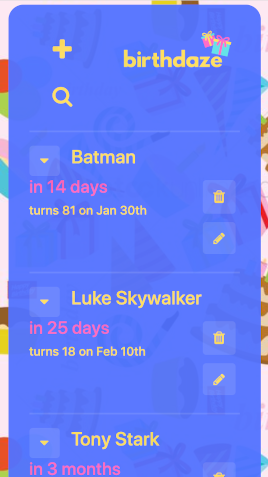
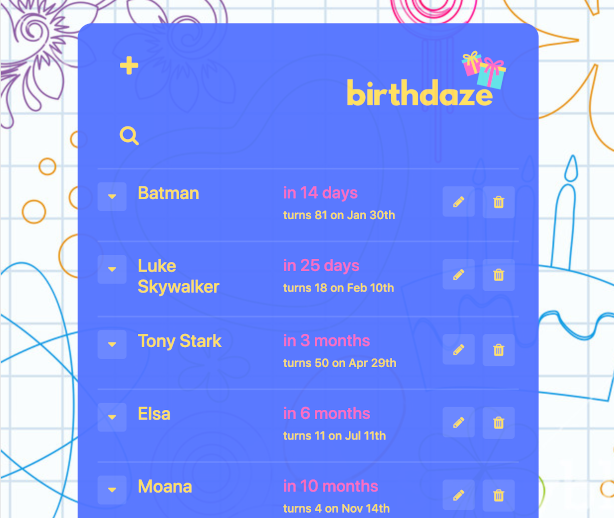

# Birthdaze Application - Frontend

This is the front end of a Birthday Application, built throughout the [Tech Returners](https://techreturners.com) Your Journey Into Tech course.

The hosted version of the application is available here: https://birthday-app-team.github.io/birthday-app-frontend/

It integrates with a backend, available at https://github.com/Birthday-App-Team/birthday-backend.

Users can view a sorted list of birthdays, add new birthdays, edit existing birthdays and delete.

### Twilio

The app also uses [Twilio](https://www.twilio.com/) to allow users to set a text to automatically send at 10am on a birthday. If a person is added on the day of their birthday and it is after 10am, the user has the option to send a text straight away when adding the new birthday.

### Technology Used

This project uses the following technology:

- ReactJS
- JavaScript (ES2015+)
- CSS
- Webpack
- Axios
- ESLint
- Twilio

It has been designed and built with mobile-first reponsive principles in mind.

#### Image of the App on iphone:

#### Image of the App on ipad:

### Running the application locally

[Node.js](https://nodejs.org/en/) must be installed if not already.

Clone the application and install dependencies:

    npm install

To start the application:

    npm start

The application will then be accessible at:

[http://localhost:3000](http://localhost:3000)